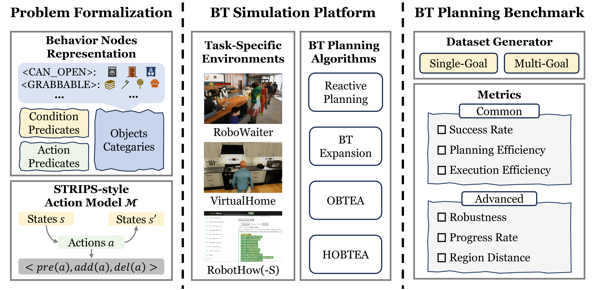
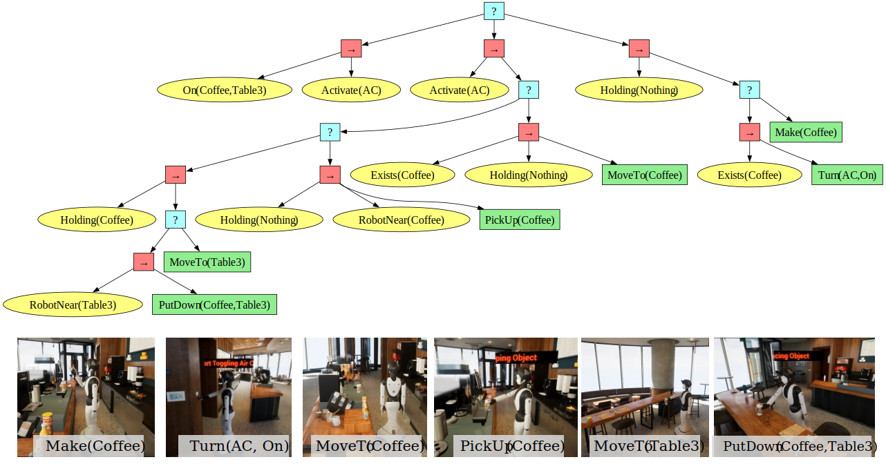
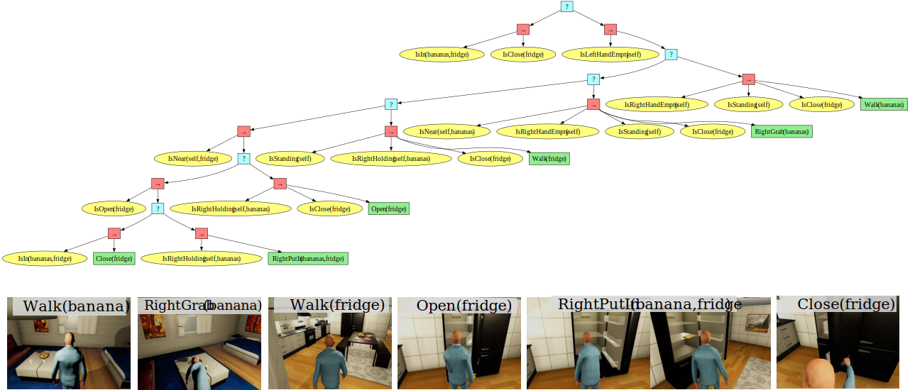

# LLM-OBTEA

**Integrating Intent Understanding and Optimal Behavior Planning for Behavior Tree Generation from Human Instructions** — *IJCAI 2024*


A two-stage framework that (1) uses **Large Language Models** to understand the intent behind high-level human instructions and (2) builds efficient, goal-specific behavior trees through the **Optimal Behavior Tree Expansion Algorithm (OBTEA / HOBTEA)**. Goals are expressed as well-formed formulas in first-order logic, bridging *intent understanding* and *optimal behavior planning*.

> ✨ This is the slim version, hosted at <https://github.com/DIDS-EI/OBTEA-demo>.
> To generate a behavior tree for a custom task, start from [`test_demo/run_demo_task.py`](test_demo/run_demo_task.py).

> 📖 A styled **HTML version** of this README (light theme, with figures) is available at [`readme.html`](readme.html).

______________________________________________________________________

______________________________________________________________________

## 📑 Table of Contents

- [Installation](#️-installation)
- [Directory Structure](#-directory-structure)
- [Usage](#-usage)
- [Getting Started](#-getting-started)
- [Generate a BT for a Custom Task](#-generate-a-bt-for-a-custom-task)
- [Simulation](#-simulation)
- [Citation](#-citation)
- [License](#-license)

## 🛠️ Installation

### 1. Create a conda environment

```shell
conda create --name BTPG python=3.10
conda activate BTPG
```

### 2. Install BTPG

```shell
cd OBTEA-demo
pip install -e .
```

### 3. Download simulators (optional, only Windows is tested)

The planning and visualization steps run without a simulator; only the *real simulation demo* needs one.

**VirtualHome**

| Operating System | Download Link                                                                      |
|:-----------------|:-----------------------------------------------------------------------------------|
| Linux            | [Download](http://virtual-home.org/release/simulator/v2.0/v2.3.0/linux_exec.zip)   |
| MacOS            | [Download](http://virtual-home.org/release/simulator/v2.0/v2.3.0/macos_exec.zip)   |
| Windows          | [Download](http://virtual-home.org/release/simulator/v2.0/v2.3.0/windows_exec.zip) |

Unzip and move the files into `simulators/virtualhome/`.

**RoboWaiter**

👉 [Download RoboWaiter](https://drive.google.com/file/d/1ayAQZbPOyQV2W-V_ZdYv6AoqLOg0zvm1/view?usp=sharing)

Unzip and run `CafeSimulator.exe`. The simulator shows an empty scene and waits for the code to populate it and drive the robot.

## 📂 Directory Structure

```
OBTEA-demo/
├── btpg/                 # Core library
│   ├── agent/            # Agent configuration
│   ├── algos/            # Algorithms
│   │   ├── bt_planning/  # BT planning: ReactivePlanning / BTExpansion / OBTEA / HOBTEA
│   │   └── llm_client/   # LLM intent-understanding client
│   ├── behavior_tree/    # Behavior tree engine and node definitions
│   ├── envs/             # Scene environments (VirtualHome / RoboWaiter / RobotHow ...)
│   └── utils/            # Helpers and utilities (incl. unified output path)
├── docs/                 # Documentation (project notes + HTML README)
├── images/               # README assets
├── output/               # Unified directory for ALL generated artifacts (git-ignored)
├── test_demo/            # Minimal example for a custom task
│   └── run_demo_task.py
├── test_exp/             # Experiment scripts
│   ├── main.py           # Interactive demo entry (easy / medium / hard)
│   ├── main_VH_easy.py
│   ├── main_VH_medium.py
│   ├── main_VH_hard.py
│   └── data/             # Test datasets
├── requirements.txt
├── setup.py
└── README.md
```

> 🗂️ **Output convention:** every generated file (`*.btml`, `*.dot`, `*.png`, `*.svg`) is written to the project-root `output/` folder, resolved at runtime via `btpg.utils.path.get_output_path()`. The folder is git-ignored, so the source tree stays clean.

## 🚀 Usage

Run the interactive demo and pick a task (easy / medium / hard) when prompted:

```shell
python test_exp/main.py
```

The generated behavior tree and its visualizations will appear under `output/`.

## 📖 Getting Started

LLM-OBTEA uses OpenAI's GPT-3.5 as the language model. You need an OpenAI API key, which you can obtain [here](https://platform.openai.com/account/api-keys).

After installation, a minimal end-to-end run looks like this:

```python
import time
from btpg import BehaviorTree
from btpg.utils.tools import setup_environment
from btpg.utils.path import get_output_path
from btpg.algos.bt_planning.main_interface import BTExpInterface
from btpg.algos.llm_client.tools import goal_transfer_str

# 1. Initialize environment and current state
env, cur_cond_set = setup_environment("VH")   # RW / RH / RHS
goal_str = 'IsIn_milk_fridge & IsClose_fridge'
goal_set = goal_transfer_str(goal_str)         # [{'IsIn(milk, fridge)', 'IsClose(fridge)'}]

# 2. Plan the behavior tree
algo = BTExpInterface(env.behavior_lib, cur_cond_set=cur_cond_set,
                      priority_act_ls=[], key_predicates=[], key_objects=[],
                      selected_algorithm="hobtea", mode="big",
                      act_tree_verbose=False, time_limit=15,
                      heuristic_choice=0, output_just_best=True)
algo.process(goal_set)
time_limit_exceeded = algo.algo.time_limit_exceeded
ptml_string, cost, expanded_num = algo.post_process()

# 3. Save and visualize (all artifacts go to output/)
output_dir = get_output_path()
btml_path = f"{output_dir}/tree.btml"
with open(btml_path, "w") as file:
    file.write(ptml_string)

bt = BehaviorTree(btml_path, env.behavior_lib)
bt.print()
bt.draw(target_directory=output_dir)           # writes .dot / .png / .svg

# 4. Execute the behavior tree
error, state, act_num, current_cost, record_act_ls, ticks = \
    algo.execute_bt(goal_set[0], cur_cond_set, verbose=False)
print(f"\x1b[32m Goal: {goal_str} \n Executed {act_num} action steps\x1b[0m",
      "\x1b[31mERROR\x1b[0m" if error else "",
      "\x1b[31mTIMEOUT\x1b[0m" if time_limit_exceeded else "")
print("Current cost:", current_cost, "Expanded nodes:", expanded_num)

# 5. (Optional) Run inside the simulator
goal = goal_set[0]
env.agents[0].bind_bt(bt)
env.reset()
is_finished = False
while not is_finished:
    is_finished = env.step()
    if goal <= env.agents[0].condition_set:
        is_finished = True
env.close()
```

## 🧩 Generate a BT for a Custom Task

To build a behavior tree for your own task (see [`test_demo/run_demo_task.py`](test_demo/run_demo_task.py)):

1. Create your environment under `btpg/envs`, e.g. `DemoEasy`. The key is defining the action and condition classes in `exec_lib`, paying attention to each action's preconditions (`pre`), additions (`add`), deletions (`del`) and optional parameters.
2. Provide the path to `exec_lib` to import the `behavior_lib`.
3. Specify the `goal` and the current state `cur_cond_set` before running the planner.
4. Drawing the BT requires the `.btml` file and the imported `behavior_lib`.

## 🎮 Simulation

Examples from two simulation scenarios, showing behavior trees generated by LLM-HOBTEA and their environments.

### RoboWaiter
A service robot performing tasks in a café.

**Goal:** `On(Coffee,Table3) & Active(AC)`


### VirtualHome
A household robot performing domestic tasks.

**Goal:** `IsIn(bananas,fridge) & IsClose(fridge)`


## 📚 Citation

This repository accompanies our **IJCAI 2024** paper. If you use this code or build on our work, please cite:

> Xinglin Chen, Yishuai Cai, Yunxin Mao, Minglong Li, Wenjing Yang, Weixia Xu, and Ji Wang.
> **Integrating Intent Understanding and Optimal Behavior Planning for Behavior Tree Generation from Human Instructions.**
> In *Proceedings of the 33rd International Joint Conference on Artificial Intelligence (IJCAI)*, pages 6832–6840, 2024.

```bibtex
@inproceedings{chen2024obtea,
  title     = {Integrating Intent Understanding and Optimal Behavior Planning for Behavior Tree Generation from Human Instructions},
  author    = {Chen, Xinglin and Cai, Yishuai and Mao, Yunxin and Li, Minglong and Yang, Wenjing and Xu, Weixia and Wang, Ji},
  booktitle = {Proceedings of the Thirty-Third International Joint Conference on Artificial Intelligence (IJCAI)},
  pages     = {6832--6840},
  year      = {2024},
  doi       = {10.24963/ijcai.2024/755},
  url       = {https://www.ijcai.org/proceedings/2024/0755.pdf}
}
```

**Resources:** [Paper (IJCAI)](https://www.ijcai.org/proceedings/2024/0755.pdf) · [arXiv:2405.07474](https://arxiv.org/abs/2405.07474) · [DOI](https://doi.org/10.24963/ijcai.2024/755)

## 📜 License

This project is licensed under the **MIT License**. See the [LICENSE](LICENSE) file for details.

Copyright © 2024 DIDS-EI. All rights reserved.

---

We will continue to update and maintain this project — stay tuned!
